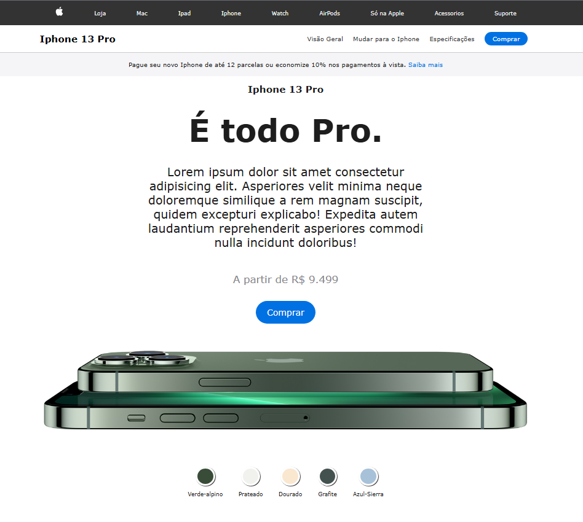

# 🍎 Apple iPhone Clone - Interface Study

Este projeto é uma landing page inspirada no design do site oficial da Apple. O foco principal foi recriar a experiência de visualização de produtos, permitindo a troca dinâmica de cores e modelos com transições suaves.

## 🚀 Tecnologias

Para este clone, utilizei tecnologias modernas de front-end para garantir fidelidade visual:

* **HTML5**: Estruturação semântica de elementos.
* **CSS3 (Flexbox & Grid)**: Layout altamente responsivo e estilização avançada (gradientes, filtros e transições).
* **JavaScript (ES6+)**: Lógica para manipulação do DOM e troca dinâmica de estados (mudança de cores e imagens do produto).

## 🛠️ Funcionalidades

* **Color Switcher**: Sistema que altera a imagem do produto e os elementos de destaque da página conforme a cor selecionada.
* **Design Responsivo**: Adaptado para visualização em diferentes dispositivos (Mobile, Tablet e Desktop).
* **Animações de Interface**: Transições suaves ao interagir com os botões de seleção de cores.
* **Fidelidade Visual**: Uso de tipografias e espaçamentos que remetem à identidade visual da Apple.

## 📸 Como ficou o projeto?



## 📂 Como testar localmente

1. Clone este repositório:

```bash

git clone https://github.com/Luis-Gustavo-MC/Javascript.git

```
2. Acesse a pasta do projeto:

```bash

cd "Projeto03 - Clone Apple"

```
3. Abra o arquivo `index.html` em seu navegador.


## 🧠 O que eu aprendi neste projeto?
* Manipulação de múltiplas imagens através do JavaScript.
* Criação de classes utilitárias no CSS para gerenciar estados ativos.
* Importância do **Design Minimalista** e como o espaçamento (white space) influencia na experiência do usuário.


## ✍️ Autor
Desenvolvido com ☕ por **Luis Gustavo**.
